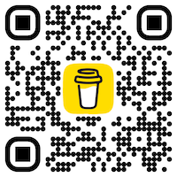

# Survivor and Settlement Tracker for Kingdom Death: Monster


_In a place of stone faces, nameless survivors stand together. They have
nothing. Only a lantern to light their struggle._

[Kingdom Death: Monster](https://kingdomdeath.com/) is cooperative game for up
to 4 players. Play survivors ekeing out an existence in the overwhelming
darkness. Your story unfolds in a campaign that is played over many nights at
the game table or ends quickly in bitter defeat.

Every decision matters. Every space moved, every resource spent, every governing
principle chosen - all have lasting impact on this highly replayable and
challenging game.

## About

This project is a [Next.js](https://nextjs.org/) web application that provides a
simple UI for keeping track of settlment and survivor information in Kingdom
Death: Monster. It is designed to be lightweight and easy to use, allowing
players to enjoy the game and save some trees.

Try it out here: [`https://archivist.monster`](https://archivist.monster)

## Support

This project is open source and free to use. _It is maintained on a best-effort
basis, with no guarantees._

If you have any questions, suggestions, or problems, please feel free to
[open an issue](https://github.com/ncalteen/kdm-app/issues).

If you like this project and want to support its development, please consider
[buying me a coffee](https://buymeacoffee.com/ncalteenw)!

[](https://www.buymeacoffee.com/ncalteenw)

### Mobile Support

Mobile support is currently limited. The site is designed to be responsive and
(mostly) mobile-friendly, but some features may not work as expected on smaller
screens. If you encounter any issues, please
[open an issue](https://github.com/ncalteen/kdm-app/issues/new)! To date, the
project has been tested on the following devices:

- iPhone XR
- iPhone 14 Pro Max
- Pixel 7
- iPad Mini
- iPad Pro

### Storage

The application uses your browser's local storage to save the following details:

| Field                          | Description                                 |
| ------------------------------ | ------------------------------------------- |
| `disableToasts`                | User setting to disable toast notifications |
| `selectedHuntId`               | Currently selected hunt ID                  |
| `selectedHuntMonsterIndex`     | Currently selected hunt monster index       |
| `selectedSettlementId`         | Currently selected settlement ID            |
| `selectedSettlementPhaseId`    | Currently selected settlement phase ID      |
| `selectedShowdownId`           | Currently selected showdown ID              |
| `selectedShowdownMonsterIndex` | Currently selected showdown monster index   |
| `selectedSurvivorId`           | Currently selected survivor ID              |
| `selectedTab`                  | Currently selected UI tab                   |

## Development

### Prerequisites

[Node.js](https://nodejs.org/en)

- See [.node-version](./.node-version) for the current version being used by
  this project.

### Getting Started

This project can be run locally for development and testing. Since it is a
static site, you can run it practically anywhere!

To get started, simply follow the below steps:

1. Fork this repository
1. Install the dependencies

   ```bash
   npm install
   ```

1. Start the development server

   ```bash
   npm run dev
   ```

1. Open your browser and navigate to
   [`http://localhost:3000`](http://localhost:3000)

## Disclaimer

This project is not affiliated with or endorsed by Kingdom Death: Monster or any
of its creators. It is a fan-made project created for personal use and
entertainment purposes only. All rights to Kingdom Death: Monster and its
associated materials are owned by their respective copyright holders. This
project is intended to be a tool for players to enhance their experience with
the game and is not intended for commercial use or distribution.

If, at any point in time, the creators of Kingdom Death: Monster would like this
project to be taken down, please contact me at `@hollow_forest` in the
[Lantern's Reign Discord](https://discord.gg/kingdomdeath) and I will remove it
immediately. I have no intention of profiting from this project or infringing on
any copyrights. I simply want to provide a tool for players to use and enjoy.

## License

This project is licensed under the MIT License. See the [LICENSE](./LICENSE)
file for details.
